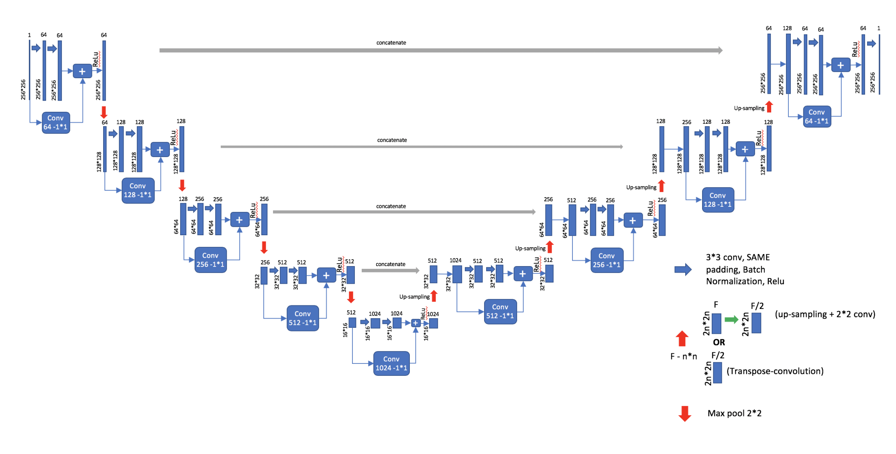

# Guidelines for Res_UNet
***
## What does the project do
* Train a self defined Res_UNet on an UAV image dataset for blue-green algae segmentation(https://www.kaggle.com/datasets/beyondstellaris/bluegreen-algae-dataset), and then use it to predict blue-green algae on Landsat5/8 images.

***
## Included files
* BlueAlgaeDataset.py: Define a blue-green algae dataset class for training, evaluation and testing.
* compute_mean_std.py: Compute the mean and the std of the blue-green algae dataset.
* eval.py: Evaluate Res_UNet on evaluation dataset.
* main.py: Train and evaluate Res_UNet on the dataset.
* my_pretesting.py: Some useful functions to access some features of datatset. (total labels, min and max pixel values of the image, etc.)
* predict.py: Use pretrained Res_UNet to predict on Landsat image.
* Res_UNet.py: The basic structure of Res_UNet.
* test.py: Test Res_UNet on a single image. (Haven't wrote testing on the full test dataset yet) 
* train.py: Basic train function on one epoch.
* transforms.py: Transform dataset before training, evaluation or testing.
* utils.py: Some useful functions referenced by other files.
***
## Quick start
1. Use compute_mean_std.py to get the mean and std value of your dataset, and then modify them in main.py.
2. Run main.py and open tensorboard to check training results.
3. Use test.py if you want to check the segmentation on some specific image.
4. Use predict.py to predict blue-algae on Landsat images.
***
## Attentions
**Before running predict.py, remember to clip your Landsat image and make sure it does not have NoData value, otherwise normalization will return all black or white image!!!**
***
## Unsolved problems
* While evaluating and testing, model.eval() causes all zero outputs, so I didn't use model.eval() in evaluating and testing, which againsts pytorch official.
* The model is not doing well on prediction on Landsat image, probably due to the differences between the training dataset and Landsat. 
##### I would be grateful if you could help me with the above and modify my codes for the better!

Thank Kaiyuan Yang for the dataset, which is accessible on https://www.kaggle.com/datasets/beyondstellaris/bluegreen-algae-dataset